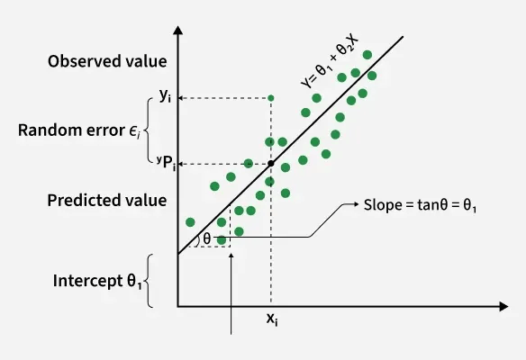
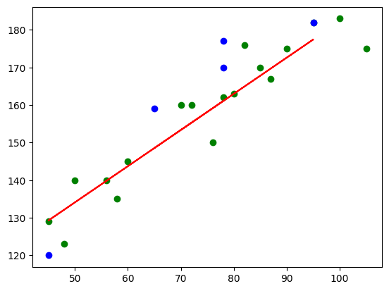
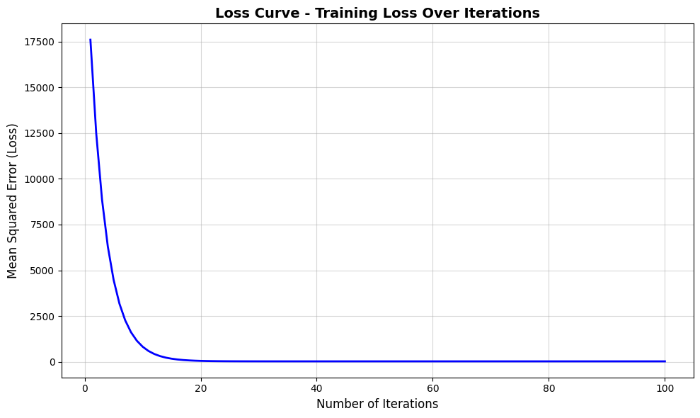

# 📈 Linear Regression — From Theory to Projects



---

## 🚀 Project Overview

This repository contains a **comprehensive Jupyter Notebook (`.ipynb`)** that explores **Linear Regression from first principles to real-world projects**.

The notebook is designed to serve as a **long-term reference**, **interview-preparation guide**, and **hands-on learning resource**.

>  **Project By - Rupayan Dey**  
> No autogenerated content. 

---

## 📂 Repository Structure

```
📦 Linear-Regression-Projects
 ┣ 📓 22.0-LinearRegressionProjects.ipynb
 ┣ 📄 README.md
 ┗ 📁 assets/
    ┗ 🖼️ screenshots/
```

---

## 🧠 Topics Covered

### 🔹 Conceptual Foundations
- What is Linear Regression?
- Assumptions & limitations
- Statistical & geometric intuition

### 🔹 Mathematical Understanding
- Hypothesis function
- Cost function (MSE)
- Gradient Descent
- Ordinary Least Squares (OLS)

### 🔹 Model Variants
- Simple Linear Regression
- Multiple Linear Regression
- Polynomial Regression (feature transformation view)
- Regularization intuition

### 🔹 Practical Implementations
- Step-by-step model building
- Visualization-based explanations
- Error analysis
- Model interpretation

---

## 🖼️ Notebook Screenshots

### 📊 Regression Visualization



### 📉 Loss / Cost Curve


### 📓 Notebook Structure


---

## 🛠️ Tech Stack

- Python 3
- Jupyter Notebook
- NumPy
- Pandas
- Matplotlib
- Scikit-learn

---

## ▶️ How to Run

```bash
git clone https://github.com/valiantProgrammer/Height-prediction-from-wight.git
cd linear-regression-projects
jupyter notebook
```

Open:
```
22.0-LinearRegressionProjects.ipynb
```

---

## 🎯 Learning Outcomes

After completing this notebook, you will be able to:

✅ Explain Linear Regression intuitively and mathematically  
✅ Distinguish OLS vs Gradient Descent  
✅ Interpret regression coefficients  
✅ Analyze error trends  
✅ Confidently answer interview questions  

---

## ✍️ Author

**Rupayan Dey**  
Machine Learning | Data Science | Applied Mathematics

> Built entirely from scratch with a focus on clarity, depth, and correctness.

---

## ⭐ Support

If you find this repository useful:
- ⭐ Star it
- 🍴 Fork it
- 📚 Use it for learning & interviews

---

## 📬 Feedback

Suggestions, issues, or improvements are welcome!
